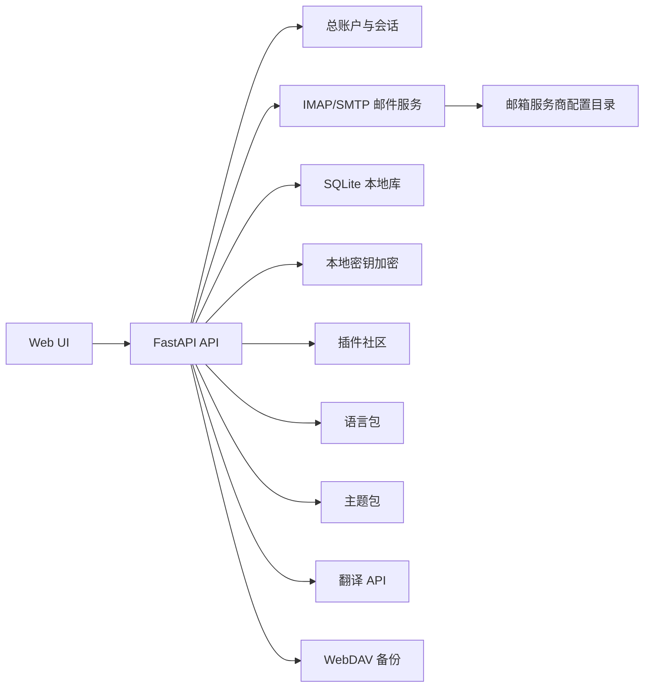

# WuYou 架构说明

## 设计原则

WuYou 的核心是邮件管理。第一版架构避免复杂前端构建链，使用 FastAPI、SQLite 和原生 Web 前端，让 Docker 部署、调试、学习和二次开发都更简单。

## 模块关系

## 数据存储

- `users`：总账户，保存用户名、邮箱、手机号和密码散列。
- `sessions`：登录会话，只保存令牌散列。
- `mailbox_accounts`：邮箱账户配置，密码、授权码和密钥以加密文本保存。
- `messages`：聚合邮件缓存，默认不允许远程内容。
- `tags` / `message_tags`：标签和邮件关联。
- `settings`：语言、主题、远程同步地址、测试数据收集等用户设置。
- `plugin_sources` / `installed_plugins`：插件社区和已安装插件。
- `content_items`：日历、通讯录、任务、便签等统一搜索接口的预留表。

## 安全策略

- 总账户密码使用 PBKDF2-SHA256 加盐散列。
- 会话令牌只在客户端保存明文，服务端只保存 SHA-256 摘要。
- 邮箱密码、授权码和密钥使用 Fernet 对称加密后入库。
- `secret.key` 和 SQLite 数据库必须一起备份，否则邮箱密钥无法解密。
- HTML 邮件默认不渲染；用户确认后使用 sandbox iframe 显示。
- 发信使用 SSL 或 STARTTLS。端到端加密通过插件接口继续扩展。

## 热更新策略

Docker 镜像承载核心程序，语言包、主题包、插件清单和安装记录都位于挂载的数据目录或本地社区目录。普通语言、主题和插件更新不需要重建镜像；核心后端代码更新仍建议通过镜像版本管理。

## 已完成
1. OAuth2：Google、Microsoft、Yahoo、Zoho 的授权登录和刷新令牌。
2. Thunderbird：解析 prefs.js、账号配置、本地 mbox/maildir 数据。
3. 端到端加密：OpenPGP 密钥管理、收发件加解密。

## 后续重点
1. Exchange Web Services (EWS) 深度支持。
2. CalDAV / CardDAV 真实服务器同步测试。
