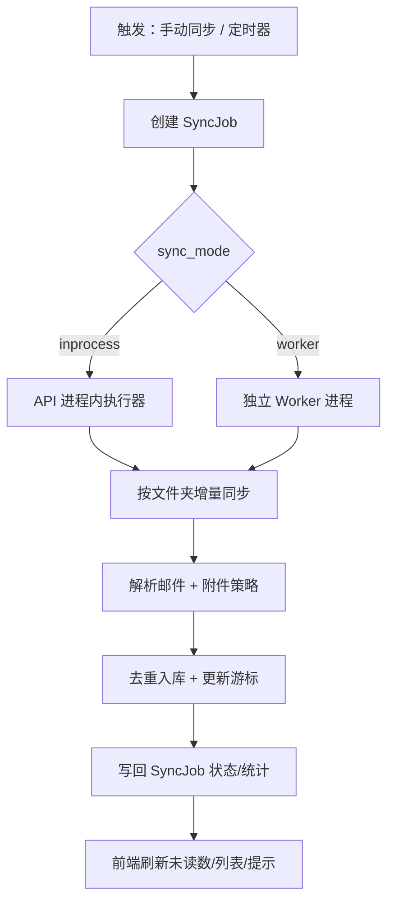

# WuYou 邮件核心 MVP（同步系统）设计稿

> 目标：把 WuYou 的“收件箱同步”做成真正可用、稳定、可扩展的核心能力，同时保持 Docker 一键部署的简单体验。
>
> 本设计稿覆盖：手动同步 + 定时后台同步（默认 30 分钟）、同步常见文件夹（INBOX/Sent/Trash/Archive/Junk）、增量拉取、任务队列、并发控制、前端交互与必要的 API/数据模型。

## 决策与范围

### 已确认决策

- 同步方式：同时支持
  - 手动同步（用户点击触发）
  - 定时后台同步（默认每 30 分钟）
- 默认并发：同一时间最多同步 `2` 个邮箱账户（其余排队）。
- 文件夹集合：默认同步 `INBOX + Sent + Trash + Archive + Junk/Spam`。
- 文件夹角色存库：使用英文枚举 `inbox / sent / trash / archive / junk`。
- 角色映射失败时：**保留原始 IMAP 文件夹命名**，作为 `custom` 文件夹显示/可选同步（默认不加入上面的 5 个集合，除非用户手动开启）。
- 架构路线：默认 **A（单进程 inprocess）** 落地，预留 **B（独立 worker）** 可切换升级。

### 不在本阶段实现（但要留好接口）

- OAuth2 / 手机验证码登录邮箱：现阶段仍为占位（需要服务商授权与网关）。
- IMAP IDLE 推送（准实时）：后续可作为增强（适配成本较高）。
- 全量邮件历史导入：本阶段优先保证“近期邮件 + 增量稳定”，全量同步会带来巨大 IO 与存储成本。

## 总体架构

### 统一任务模型（手动/定时共用）



### 两种运行模式（可通过配置切换）

- `inprocess`（默认）：
  - FastAPI 启动时开启轻量 scheduler（定时创建任务）
  - 同步执行由“任务执行器（线程池）”完成
  - 优点：部署最简单，MVP 最快可用
- `worker`（预留）：
  - API 只创建任务（入队），不做实际 IMAP 拉取
  - `wuyou-worker` 独立进程拉取队列并执行
  - 优点：同步负载与 Web API 隔离，更稳更易扩容

> 重要原则：无论哪种模式，**同步逻辑只写一份**，差别仅在“谁来消费 sync_jobs”。

## 数据模型变更

> 当前后端使用 SQLite + WAL。同步写入频繁，必须把“游标/文件夹/任务”拆出来，避免仅靠 `messages` 表难以做增量与可观测性。

### 新表：`mailbox_folders`

用于保存“语义文件夹角色”与真实 IMAP 文件夹名之间的映射，并允许保存无法映射的 `custom` 文件夹。

- `id` INTEGER PK
- `user_id` INTEGER NOT NULL（外键 users.id）
- `mailbox_id` INTEGER NOT NULL（外键 mailbox_accounts.id）
- `role` TEXT NOT NULL
  - `inbox|sent|trash|archive|junk|custom`
- `imap_name` TEXT NOT NULL（真实 IMAP 文件夹名）
- `source` TEXT NOT NULL
  - `special_use|guess|manual|raw`
- `enabled` INTEGER NOT NULL DEFAULT 1（是否同步该 folder）
- `created_at` TEXT NOT NULL
- `updated_at` TEXT NOT NULL
- 唯一约束建议：`UNIQUE(user_id, mailbox_id, role, imap_name)`

### 新表：`mailbox_folder_state`

用于保存每个 folder 的增量同步游标。

- `id` INTEGER PK
- `user_id` INTEGER NOT NULL
- `mailbox_id` INTEGER NOT NULL
- `role` TEXT NOT NULL（同上）
- `imap_name` TEXT NOT NULL
- `uidvalidity` INTEGER（IMAP UIDVALIDITY）
- `last_uid` INTEGER NOT NULL DEFAULT 0（增量游标）
- `last_sync_at` TEXT
- `last_error` TEXT
- 唯一约束建议：`UNIQUE(user_id, mailbox_id, imap_name)`

### 新表：`sync_jobs`

用于统一记录每次同步任务（无论手动/定时），并提供 UI 可观测性。

- `id` INTEGER PK
- `user_id` INTEGER NOT NULL
- `mailbox_id` INTEGER NOT NULL
- `trigger` TEXT NOT NULL：`manual|scheduled`
- `status` TEXT NOT NULL：`queued|running|success|failed|canceled`
- `folder_roles_json` TEXT NOT NULL（JSON 数组，如 `["inbox","sent",...]`）
- `stats_json` TEXT NOT NULL DEFAULT `'{}'`
  - 例如：`{"fetched": 20, "inserted": 12, "attachments_downloaded": 3, "duration_ms": 8200}`
- `error` TEXT（失败原因摘要）
- `created_at` TEXT NOT NULL
- `started_at` TEXT
- `finished_at` TEXT

### 现有表 `messages` 的扩展（建议）

当前表内已有 `folder` 字段，但它更像“展示用字符串”。为了聚合与筛选稳定，建议追加：

- `folder_role` TEXT NOT NULL DEFAULT `'inbox'`
  - `inbox|sent|trash|archive|junk|custom`
- `imap_folder` TEXT NOT NULL DEFAULT `'INBOX'`

并保持原有唯一约束 `UNIQUE(user_id, mailbox_id, external_id)` 不变。

## 文件夹发现与映射

### 目标

不同服务商的 IMAP folder 命名差异巨大；产品上用户只关心“收件箱/已发送/垃圾箱/归档/垃圾邮件”。因此需要做“语义层”的统一。

### 规则

1. 优先使用 IMAP `LIST` 结果中的 **special-use 标记**（如果服务商支持）：
   - `\Sent` → `sent`
   - `\Trash` → `trash`
   - `\Archive` → `archive`
   - `\Junk` / `\Spam` → `junk`
2. 若无标记，使用 **名称猜测**（多语言关键词匹配）：
   - `sent|已发送|发件箱|outbox` → `sent`
   - `trash|deleted|已删除|垃圾箱` → `trash`
   - `archive|归档` → `archive`
   - `junk|spam|垃圾邮件` → `junk`
3. 仍无法匹配的 folder：
   - 写入 `mailbox_folders(role=custom, source=raw, imap_name=<原名>)`
   - UI 使用原名显示
   - 默认 `enabled=0`（避免突然同步大量无关文件夹），后续提供“开启同步”开关

> 本阶段 UI 可以先只展示 5 个默认角色 + 一个“更多文件夹（自定义）”折叠区域；后续再做完整文件夹树。

## 增量同步算法（每个 folder）

### 核心原则

- 不做 `SEARCH ALL` + 取最后 N 封（当前实现会重复、并且无法稳定增量）。
- 使用 **UID 增量**：保存 `UIDVALIDITY + last_uid`，并用 `UID SEARCH UID {last_uid+1}:*` 获取增量。

### 同步步骤

```mermaid
flowchart TD
  A[读取 folder_state] --> B[SELECT folder 取 UIDVALIDITY]
  B --> C{UIDVALIDITY 变化?}
  C -->|是| D[重置 last_uid=0 并记录提示]
  C -->|否| E[继续]
  D --> E
  E --> F[UID SEARCH UID last_uid+1:*]
  F --> G[分页 UID FETCH 拉取 RFC822/FLAGS]
  G --> H[解析正文/附件(按设置)]
  H --> I[INSERT OR IGNORE 去重入库]
  I --> J[更新 last_uid=max(uid) / last_sync_at]
```

### 附件策略（与现有实现保持一致，但补齐边界）

- 默认开启自动下载（与当前 `attachment_auto_download=true` 一致）。
- 限制：
  - 建议增加 `max_attachment_bytes`（默认例如 25MB，后续可配置）
  - 避免重复写同名文件：使用安全文件名 + 冲突后缀（现有已做基础处理）

## 任务调度与并发控制

### 配置项（建议新增到 Settings）

- `sync_interval_minutes: int = 30`
- `sync_concurrency: int = 2`
- `sync_folders_default: ["inbox","sent","trash","archive","junk"]`

也可提供环境变量覆盖：
- `UNIBOX_SYNC_INTERVAL_MINUTES=30`
- `UNIBOX_SYNC_CONCURRENCY=2`
- `UNIBOX_SYNC_MODE=inprocess|worker`

### 定时器行为（scheduled）

- 每隔 `sync_interval_minutes`：
  - 遍历 `mailbox_accounts.sync_enabled=1`
  - 过滤掉“已经有 running/queued job 的 mailbox”（避免堆积）
  - 创建新的 `sync_jobs(trigger=scheduled, status=queued, folder_roles_json=默认集合)`

### 手动同步行为（manual）

- 用户点击“同步”：
  - 创建 `sync_jobs(trigger=manual, status=queued, ...)`
  - 允许“强制插队”可作为后续增强（本阶段先简单排队）

### 并发与队列

- 全局并发上限：`sync_concurrency=2`
- 一个 mailbox 同时只允许一个 running job（避免 IMAP 连接冲突与状态难以维护）
- `worker` 模式下，worker 按“可执行队列”取任务并加锁运行

## API 设计（新增/调整）

### 同步任务

- `POST /api/sync/jobs`
  - 入参：`mailbox_id`、可选 `folder_roles`（默认 5 个）
  - 返回：`job_id` + “已加入队列”
- `GET /api/sync/jobs`
  - 支持过滤：`mailbox_id`、`status`、`limit`
- `GET /api/sync/jobs/{job_id}`
  - 返回：状态、统计、错误摘要、时间戳

### 复用现有接口（兼容前端）

- 现有 `POST /api/accounts/{account_id}/sync`
  - 改为“创建任务并返回 job_id”
  - 前端 toast：`已加入同步队列` / `正在同步` / `同步完成（新增 X 封）`

### 邮件列表（增强筛选）

- `GET /api/mail/inbox`
  - 增加：`folder_role=all|inbox|sent|trash|archive|junk|custom`
  - 默认仍为 `all`

### 文件夹映射（后续 UI 需要）

- `GET /api/accounts/{mailbox_id}/folders`
  - 返回：当前已识别 folder（含 custom）
- `PUT /api/accounts/{mailbox_id}/folders`
  - 允许用户手动调整映射/启用状态（source=manual）
  - 本阶段可以先只做后端接口，UI 后补

## 前端交互（MVP）

- 收件箱页面：
  - 增加一个 folder role 切换（`全部/收件箱/已发送/垃圾箱/归档/垃圾邮件`）
  - 增加一个“更多文件夹（自定义）”入口（可先仅展示列表，不做树）
- 同步按钮：
  - 点击后立即 toast：`已加入队列`
  - 若能拿到 job 状态：toast 更新为 `正在同步` / `同步完成` / `同步失败：原因`
  - 同步完成后刷新：未读数、列表

## 可靠性与错误处理

- IMAP 连接失败、登录失败、SELECT/SEARCH/FETCH 失败：
  - 任务置为 `failed`，`sync_jobs.error` 写入摘要
  - `mailbox_folder_state.last_error` 写入最后错误（用于 UI/排查）
- UIDVALIDITY 变化：
  - 重置游标并记录提示（可能会造成“重新拉取近期邮件”，但依赖唯一约束去重）
- 进程重启：
  - `running` 状态的任务在启动时统一标记为 `failed/canceled`（写清原因：服务重启）
  - 下一轮 scheduled 会自动补偿

## 测试计划（最小集合）

- 单邮箱：
  - 首次同步：能拉取 INBOX + 4 个常见 folder（若可识别）
  - 二次同步：只拉取增量（last_uid 生效）
- 多邮箱：
  - 并发=2：同时触发 3 个邮箱同步，验证 2 个并发 + 1 个排队
- 异常：
  - 错误密码：任务 failed，错误信息可见
  - folder 映射失败：custom folder 记录原名，且不会导致崩溃

## 开源与合规备注

- 本设计不引入“闭源依赖”。如后续引入第三方队列（Redis/RabbitMQ）与调度器（APScheduler/Celery），需再次审核其许可证与二次分发条件。

